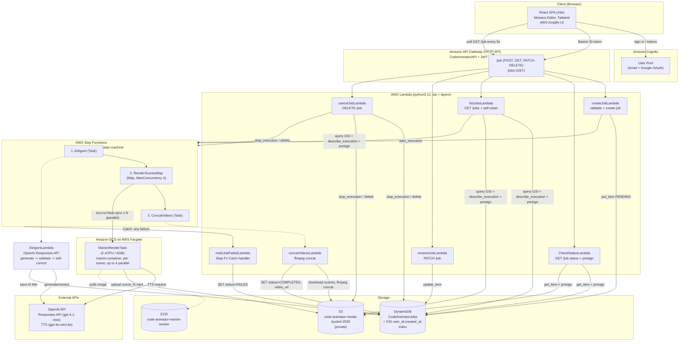

# CodeAnimator — Architecture Documentation

> Generated from a full read of the repository at commit `5d2c6dc` (main).
> CodeAnimator turns Python code into narrated Manim animations. The
> infrastructure was built and deployed inside an **AWS Academy Learner Lab**
> account (`719246278807`, `us-east-1`), which shapes several design
> decisions called out throughout this document.

---

# PART 1: High-Level Architecture

## 1. System Overview & Core Purpose

CodeAnimator is a full-stack web application that converts a snippet of
Python code into a short, narrated animated video explaining how that code
works. The user pastes code into a browser-based editor, picks an
explanation depth, and clicks **Generate**; a few minutes later a
narrated `.mp4` (rendered with [Manim Community](https://www.manim.community/),
voiced with OpenAI TTS) is ready to watch, download, and revisit from a
per-user history sidebar.

**Primary user workflow:**

1. Sign in (email/password or Google OAuth via Amazon Cognito).
2. Paste Python code into a Monaco editor; choose an explanation depth
   (*High-level / Balanced / Detailed*).
3. Click **Generate Video**. If the code doesn't compile, the user is asked
   whether to fix it themselves or generate a video that explains the bug.
4. The frontend polls job status every 5s while an AI agent writes and
   validates Manim scenes, then AWS Fargate renders each scene with a TTS
   voiceover and the scenes are concatenated into one video.
5. The finished video plays in-browser (with audio) and can be downloaded,
   renamed, or deleted; all past videos are listed per-user in a sidebar.

The defining engineering feature is the **AI agent's self-correction
loop**: generated Manim code is never sent to the (expensive, slow) renderer
until it has been statically validated — and, where possible, dry-run
executed — locally inside the Lambda/container, with failures fed back to
the model for automatic fixes. This keeps failed renders (and wasted Fargate
minutes) rare.

## 2. System Architecture Diagram



## 3. Component Breakdown

| Layer | Technology | Responsibility |
|---|---|---|
| **UI layer** | React 19 SPA (Vite build), Tailwind CSS v4, Monaco code editor, `@aws-amplify/ui-react` Authenticator | Auth UI, code input, job/status polling, video playback, per-user history sidebar, onboarding, theming ("Codima" mascot color). |
| **Auth** | Amazon Cognito User Pool + Hosted UI (Google federated sign-in) | Issues JWTs; API Gateway's JWT authorizer validates them; the ID token's `sub` claim is the durable per-user identity used everywhere in the backend. |
| **API layer** | API Gateway **HTTP API** (`CodeAnimatorAPI`) | Single REST-ish surface (`/job`, `/jobs`) fronting all Lambdas; enforces the Cognito JWT authorizer on every route except (implicitly) whatever `createJobLambda`/`CheckStatusLambda` allow through. |
| **Control-plane Lambdas** | Python 3.12, zip deployment | CRUD around a job's lifecycle in DynamoDB and orchestration of the Step Functions execution — no rendering logic lives here. |
| **Generation engine** | `AIAgentLambda` + OpenAI Responses API | The "brain": turns raw user code into a structured list of narrated Manim scenes and guarantees (as far as static/dry-run analysis can) that the code will actually render. |
| **Orchestration** | AWS Step Functions (Standard workflow, ASL) | Sequences generation → parallel rendering (`Map` state, concurrency 4) → concatenation, with a single `Catch`-driven failure path (`MarkFailed`) wired to every task. |
| **Background workers** | ECS Fargate tasks (`ManimRenderTask`, one per scene, launched via `ecs:runTask.sync`) | Actual heavy lifting: OpenAI TTS synthesis, Manim video rendering, ffmpeg audio/video muxing, upload to S3. Ephemeral — one task per scene, ~2 vCPU/4GB each. |
| **Storage** | DynamoDB (`CodeAnimatorJobs`) + S3 (`code-animator-media-bucket-2026`, private) | DynamoDB is the single source of truth for job state/metadata; S3 holds per-scene renders and the final concatenated video, both under `jobs/{job_id}/`. |
| **Container registry** | Amazon ECR | Hosts the versioned `code-animator-manim-worker` image that the Fargate task definition points at. |
| **External API** | OpenAI (Responses API + TTS API) | Scene generation/correction (`gpt-4.1-mini` in production) and narration synthesis (`gpt-4o-mini-tts`, voice `alloy`). |

## 4. Data Flow

End-to-end trace of a single "Generate Video" click:

1. **Client-side validation choice.** The frontend calls `POST /job` with
   `{ user_code, complexity }`. `createJobLambda` statically compiles the
   code (`compile(..., ast.PyCF_ONLY_AST)`) and runs `pyflakes` for
   undefined names. If it's broken and the user hasn't chosen a `mode` yet,
   the Lambda returns `{ needs_choice: true, error }` **without creating a
   job** — the frontend shows a choice screen ("explain the bug" vs. "go fix
   it").
2. **Job creation.** Once a mode is settled (or the code was fine), a
   `job_id` (UUID4) is minted, a `PENDING` row is written to DynamoDB
   (including the raw `user_code`, so a refreshed page can restore exactly
   what produced a given job), and a Step Functions execution is started
   with `{ job_id, user_code, complexity, [mode, code_error] }` as input.
3. **Scene generation (`AIAgentLambda`).** One OpenAI Responses API call
   with a strict JSON schema returns a `title` and a dynamically-sized list
   of `{ scene_id, narration, manim_code }`. The AI-generated title is
   immediately persisted to DynamoDB (best-effort) so the sidebar/processing
   screen can show it before the job finishes.
4. **Validation & self-correction (still inside `AIAgentLambda`, before any
   Fargate task runs).** Every scene's `manim_code` passes through three
   tiers — `ast.parse` syntax check, a static Manim-API lint, and (only
   where the `manim` package is importable) a real dry-run execution with
   `config.dry_run = True`. Failing scenes are sent back to the model with
   their exact error text for up to `MAX_RETRIES` (default 3) rounds,
   bounded by the Lambda's remaining execution time. Passing scenes are
   frozen and never regenerated. If any scene still fails after all rounds,
   the whole job fails loudly here — nothing broken ever reaches the
   renderer.
5. **Parallel rendering (`RenderScenesMap` → Fargate).** Step Functions maps
   over the validated scenes (`MaxConcurrency: 4`) and synchronously runs
   one `ManimRenderTask` per scene via `ecs:runTask.sync`, passing
   `JOB_ID`, `SCENE_ID`, `NARRATION`, `MANIM_CODE` as container environment
   overrides. Inside each task: OpenAI TTS synthesizes the narration audio
   → `manim -qm` renders the scene to an `.mp4` → ffmpeg muxes audio into
   video (freezing the last frame if narration outruns the animation, or
   padding silence if the video is longer) → the muxed scene is uploaded to
   `s3://code-animator-media-bucket-2026/jobs/{job_id}/scenes/scene_{id}.mp4`.
6. **Concatenation (`concatVideosLambda`).** Once every Map iteration
   completes, this Lambda lists and downloads all `scene_*.mp4` objects for
   the job, sorts them, and stream-copies them together with `ffmpeg -c
   copy` (no re-encoding — safe because every scene was encoded with
   identical codec parameters in step 5) into `final_output.mp4`, uploads
   it, and sets DynamoDB `status = COMPLETED` with the object's URL.
7. **Failure path.** A `States.ALL` `Catch` on every state
   (`AIAgent`, `RenderScenesMap`, `ConcatVideos`) routes to `MarkFailed`,
   which sets `status = FAILED` in DynamoDB so polling clients get a clean
   terminal state instead of hanging forever.
8. **Client polling & playback.** The frontend polls `GET /job?job_id=...`
   every 5s. `CheckStatusLambda` reads DynamoDB and, if a `video_url` is
   present, converts the stored S3 URL into a **1-hour presigned URL**
   (the bucket is private) before returning it. On `COMPLETED` the
   `<video>` element loads that presigned URL directly from S3 for
   playback/streaming — video bytes never pass through Lambda/API Gateway.

## 5. Cloud Infrastructure & AWS Learner Lab Details

The entire backend was built and is deployed inside an **AWS Academy
Learner Lab**, which imposes constraints not present in a normal AWS
account, and those constraints are visible throughout the codebase:

- **No custom IAM roles/policies — everything uses `LabRole`.** Learner Lab
  accounts cannot create IAM roles or attach arbitrary policies (`iam:*` is
  restricted); every Lambda, the ECS task role, and the ECS execution role
  all use the lab-provided `arn:aws:iam::719246278807:role/LabRole`
  (see `backend/ecs/ManimRenderTask.json`). This means there is no
  least-privilege separation between services — the Fargate render task
  and every Lambda share one broad permission set. In a normal account,
  each Lambda/task would get its own scoped role.
- **Temporary/rotating session credentials.** Learner Lab sessions issue
  STS credentials that expire (typically every few hours) and rotate on
  every lab restart. This is why the project has **no IaC** (no CDK/SAM/
  Terraform/CloudFormation templates) — those workflows assume long-lived
  credentials/roles you can `deploy` against repeatedly. Instead, the repo
  tracks **JSON exports** of the live configuration (`backend/dynamodb/
  CodeAnimatorJobs.json`, `backend/ecs/ManimRenderTask.json`,
  `backend/step-functions/ai-code-animator-state-machine.json`) as
  documentation/recovery artifacts, and deployment is manual
  `aws lambda update-function-code` / console clicks, redone whenever the
  lab session resets.
- **Secrets Manager / SSM Parameter Store are unused (should be used).**
  The OpenAI API key is stored as a **plaintext Lambda environment
  variable** on `AIAgentLambda` and, worse, as a **literal value inside the
  Step Functions ASL definition's** `RunFargateTask` container override
  (`OPENAI_API_KEY`). `backend/step-functions/README.md` documents a real
  incident from **2026-07-30 (~20 minutes of outage)**: the tracked JSON
  (which has the key redacted to `REPLACE_WITH_OPENAI_API_KEY`) was
  deployed directly over the live state machine, wiping the real key and
  breaking every TTS call. Learner Lab's restricted IAM makes it non-trivial
  to grant Lambda/ECS `secretsmanager:GetSecretValue` cleanly (some labs
  block Secrets Manager or KMS key creation entirely), which is likely why
  the key ended up as a plain literal instead — but the README explicitly
  flags moving it to Secrets Manager/SSM and referencing it via the ECS task
  definition's `secrets` block as the correct fix once permissions allow it.
- **Region-locked, account-pinned ARNs.** Every ARN in the codebase is
  hardcoded to `us-east-1` / account `719246278807` (Learner Lab accounts
  are single-region-oriented and the account ID is fixed for the lab's
  lifetime), e.g. the Step Functions definition's `Resource` fields and
  `cancelJobLambda`'s `EXECUTION_ARN_PREFIX`. There's no parameterization
  for multi-account/multi-region deployment.
- **No container-image Lambdas.** The README notes Lambda compute uses
  "python3.12 (zip + layers — no container Lambdas needed)". This keeps
  cold starts fast and avoids needing ECR permissions for Lambda (Learner
  Lab ECR access is scoped/limited), at the cost of manually building two
  Lambda **layers**:
  - `openai-linux-layer` — the `openai` SDK, built for `manylinux2014_x86_64`.
  - `ffmpeg-layer` — `imageio-ffmpeg`'s bundled static ffmpeg binary
    (`concatVideosLambda` has no OS-level ffmpeg available in the Lambda
    runtime otherwise). The layer README warns that zipping it with
    PowerShell's `Compress-Archive` silently strips the Unix executable
    bit, breaking ffmpeg at runtime — it must be built with the provided
    `build_ffmpeg_layer_zip.py` or Linux `zip`.
- **AWS services in play:**
  - **Amazon Cognito** — user pool + hosted UI for auth (email + Google
    OIDC), issues the JWT the API Gateway authorizer validates.
  - **Amazon API Gateway (HTTP API)** — `CodeAnimatorAPI`, thin routing +
    JWT authorization in front of the Lambdas.
  - **AWS Lambda** — 8 functions (7 active + 1 stub), python3.12, zip +
    layers, all under `LabRole`.
  - **AWS Step Functions** — one Standard state machine coordinating the
    whole render pipeline (generate → map/render → concat), with a single
    catch-all failure branch.
  - **Amazon ECS on AWS Fargate** — `CodeAnimatorCluster2`, running
    `ManimRenderTask` (2 vCPU / 4 GB, `awsvpc` networking, a single public
    subnet with `AssignPublicIp: ENABLED` — the Learner Lab's default VPC
    setup, since NAT gateways cost money/require setup this lab likely
    doesn't provide by default) — one ephemeral task per scene, up to 4
    concurrently.
  - **Amazon ECR** — hosts `code-animator-manim-worker`, an image chain
    built on a pre-existing Manim/TeX Live base image with ffmpeg and
    `render_worker.py` layered on top (current production tag: `v4`).
  - **Amazon DynamoDB** — `CodeAnimatorJobs` table, on-demand billing
    (`PAY_PER_REQUEST`, sensible for a lab environment with unpredictable/
    bursty usage and no capacity planning desire), partition key `job_id`;
    a `user_id-created_at-index` GSI is used by `listJobsLambda` but is
    **not present in the tracked table JSON** — it was added directly in
    the console after the fact (a small piece of infra drift worth
    reconciling into the tracked export).
  - **Amazon S3** — `code-animator-media-bucket-2026`, private bucket,
    holds per-scene and final rendered videos; all access is through
    presigned URLs minted server-side (1-hour expiry).
  - **AWS Amplify Hosting** — the frontend is deployed at
    `https://main.d13stb50mb84v8.amplifyapp.com/` (and a custom domain,
    `codeanimator.app`), per the redirect URLs configured in
    `frontend/src/amplify.js`; this is Amplify Hosting for the static SPA
    build, separate from the Amplify *library* used for Cognito auth in
    the frontend code.
  - **Amazon CloudWatch Logs** — the ECS task definition explicitly
    configures the `awslogs` driver with `awslogs-create-group: true`
    (`/ecs/ManimRenderTask`), since Learner Lab roles typically can't
    pre-create log groups via a separate IAM path — the task creates its
    own group on first run.

---

# PART 2: Detailed Architecture & Code Explanation

## 1. Module Breakdown & Directory Structure

```
CodeAnimator/
├── frontend/                            React SPA (Vite + Tailwind v4 + Monaco)
│   ├── src/
│   │   ├── amplify.js                   Amplify.configure(): Cognito pool/client IDs, OAuth domain, redirect URLs
│   │   ├── main.jsx                     App entrypoint; wraps App in Amplify's <Authenticator> (email + Google), custom login header/theme
│   │   ├── App.jsx                      Top-level gate: profile-loaded -> onboarding? -> jobs-loaded? -> MainLayout
│   │   ├── context/AppContext.jsx       THE state machine of the whole app (see §3) — auth profile, job list, active job polling, view state
│   │   ├── api/videoApi.js              Thin fetch wrappers for /job, /jobs (attaches Cognito ID token as Bearer auth)
│   │   ├── layouts/MainLayout.jsx       Sidebar + content area + persistent tinted mascot background
│   │   ├── components/Sidebar.jsx       Account info, "New Video", job history list (rename/delete inline), Codima color picker, sign out
│   │   ├── components/Onboarding.jsx    First-run flow: collect name (skipped for Google users) + mascot color
│   │   ├── components/Preview/
│   │   │   ├── CodeInputState.jsx       Monaco editor + explanation-depth selector + Generate button (the "idle" view)
│   │   │   ├── CodeErrorChoice.jsx      Shown when user_code fails static validation — "explain the bug" vs "back to editing"
│   │   │   ├── ProcessingState.jsx      Polling/loading screen; "checking" vs "generating" sub-phases, rotating flavor messages
│   │   │   ├── DoneState.jsx            Video player + inline read-only code viewer + rename/download
│   │   │   └── GenFailed.jsx            Terminal failure screen with a "try again" reset
│   │   ├── mascotColors.js              CSS hue-rotate filter table for the "Codima" mascot theming system
│   │   └── pages/GeneratorPage.jsx      Switches between the Preview/* views based on AppContext's `view` state
│   └── public/                          Static SVG assets (logo, mascot, icons)
│
├── backend/
│   ├── lambdas/
│   │   ├── AIAgentLambda/               The generation engine (see §2, §3)
│   │   │   ├── lambda_function.py       Handler: orchestrates generate -> validate -> self-correct loop
│   │   │   ├── prompts.py               System prompts, JSON schemas, complexity directives, message builders
│   │   │   ├── validator.py             3-tier scene validation (syntax / lint / dry-run)
│   │   │   ├── local_test.py            Standalone harness — runs the whole loop without any AWS service
│   │   │   └── requirements.txt         `openai` only (manim intentionally excluded from the deploy zip)
│   │   ├── createJobLambda/             POST /job — static user-code validation, job creation, starts the state machine
│   │   ├── CheckStatusLambda/           GET /job — job lookup + presigned video URL
│   │   ├── listJobsLambda/              GET /jobs — per-user job list, self-cleans junk/dead rows on every call
│   │   ├── renameJobLambda/             PATCH /job — ownership-checked title rename
│   │   ├── cancelJobLambda/             DELETE /job — stops a running execution OR purges a completed job's S3 media, then the row
│   │   ├── markJobFailedLambda/         Step Functions Catch target — flips a job to FAILED
│   │   └── ApiTriggerLambda/            Unused scaffold stub ("Hello from Lambda!") — not wired into the API or state machine
│   ├── fargate-worker/
│   │   ├── render_worker.py             Per-scene worker: TTS -> manim render -> ffmpeg mux -> S3 upload
│   │   └── Dockerfile                   Extends the deployed manim/TeX Live base image, adds ffmpeg + render_worker.py
│   ├── layers/                          Build instructions for openai-linux-layer and ffmpeg-layer
│   ├── step-functions/
│   │   ├── ai-code-animator-state-machine.json   Tracked ASL definition (OpenAI key redacted)
│   │   └── README.md                    Deploy-hazard warning (see §4) — never push this file as-is
│   ├── ecs/ManimRenderTask.json         ECS task definition export (family ManimRenderTask, LabRole, 2vCPU/4GB)
│   └── dynamodb/CodeAnimatorJobs.json   Table schema export (job_id hash key, PAY_PER_REQUEST) — GSI not reflected here
│
├── poc/                                 Pre-production proof-of-concept, not part of the deployed pipeline
│   ├── ast_service/                     Standalone Python AST-parsing service (parser registry pattern, CLI + module API)
│   └── code_animator_poc/engine.py      Early exploratory Manim animation-engine class design
│
└── docs/                                Session report PDF, misc notes
```

## 2. Key Code Workflows

### 2.1 AI scene generation & self-correction loop (`AIAgentLambda/lambda_function.py`)

This is the most architecturally significant piece of code in the repo.
Step by step:

1. **Input**: `{ job_id, user_code, complexity, mode?, code_error? }` from
   the Step Functions execution input (itself built by `createJobLambda`).
2. **`_generate_scenes`** builds a user message from `prompts.py` — either
   `build_generation_user_message` (normal) or
   `build_buggy_generation_user_message` (`mode == "explain_bug"`, which
   instructs the model to keep the *original broken code* on screen and
   narrate the fix rather than silently repairing it) — and calls
   `client.responses.create(...)` with `text={"format": GENERATION_SCHEMA}`,
   a strict JSON schema enforcing `{ title, scenes: [{scene_id, narration,
   manim_code}] }`. `temperature=0.2` favors consistency over creativity.
3. Scenes are sorted by `scene_id`; the title is persisted to DynamoDB
   immediately (`_save_title`, wrapped so a failure here never fails the
   job — it's cosmetic).
4. **`_validate_scenes`** runs every scene through `validator.validate_scene`
   (see §2.2) and partitions them into passed (annotated fields stripped)
   and `failed` (annotated with `error` + `tier`).
5. **Correction loop**: while `failed` is non-empty and
   `rounds < MAX_RETRIES` (default 3) *and* the Lambda has more than
   `TIME_BUFFER_MS` (default 20s) of execution time left
   (`context.get_remaining_time_in_millis()`), one OpenAI call
   (`CORRECTION_SCHEMA`) is made with **all currently-failing scenes**
   batched together (their narration, broken code, and exact error text).
   The response's fixes are applied **only** to scene IDs that were
   actually in the failed set that round — a defensive check against a
   stray/malformed fix silently overwriting an already-validated scene.
   Fixed scenes are re-validated; the loop repeats.
6. **Termination**: if scenes are still failing after the loop exits,
   `SceneValidationError` is raised (fails the Step Functions execution,
   routed to `MarkFailed`). Otherwise, error/tier annotations are stripped
   and `{ scenes, job_id, title }` is returned — **raw code strings only**,
   no video has been touched yet.

### 2.2 Tiered validation (`AIAgentLambda/validator.py`)

Each tier only runs if the previous one passed, and validation is
**environment-adaptive** via `MANIM_AVAILABLE = importlib.util.find_spec("manim") is not None`:

1. **Syntax** (`ast.parse`) — catches malformed Python outright; always runs.
2. **Static Manim lint** (`_check_lint`, pure AST walk, always runs):
   - Requires a `manim` import to exist at all.
   - Requires exactly one `class X(Scene):`-shaped subclass with a
     `construct(self)` method.
   - Flags any use of a curated table of **removed ManimCE APIs**
     (`REMOVED_APIS` — e.g. `ShowCreation`, `TextMobject`, `GraphScene`,
     `FadeInFrom`) with the correct modern replacement baked into the error
     text, since these are exactly the APIs LLMs hallucinate from
     legacy/pre-CE Manim documentation they were trained on.
   - Flags renamed keyword arguments on `Code(...)` (`RENAMED_KWARGS` — the
     ManimCE 0.19 `Code` mobject signature change, e.g. `code=` →
     `code_string=`).
   - Flags `code_mobject.code[i]`-style subscripting, since `Code` has no
     `.code` attribute in current ManimCE and this is a common hallucinated
     pattern for highlighting individual lines — a runtime `AttributeError`
     that no other static check would catch (not a call, not a kwarg).
3. **Dry-run execution** (`_check_dry_run`) — only if `manim` is
   importable in the current runtime. Writes the scene code plus an
   appended driver (`_DRY_RUN_DRIVER`) to a temp file, which locates the
   `Scene` subclass and calls `.render()` with `config.dry_run = True`
   (no video output, but full construct-time execution) in a **subprocess**
   with a timeout (default 30s). A timeout is treated as "likely an infinite
   loop / too heavy" rather than a generic error. `manim` is deliberately
   **excluded** from the Lambda's zip package (it needs system-level
   pango/cairo libraries and would blow the size limit) — this tier
   therefore only actually executes during local development
   (`local_test.py`) or if the Lambda ever moved to a container image with
   `manim` preinstalled. In the deployed zip Lambda, validation silently
   stops at tier 2 (`passed=True, tier="lint"`), meaning ManimCE
   *runtime* errors that a linter can't foresee (e.g. bad geometry, timing
   math) can still surface for the first time inside the ECS render task —
   see §4.

### 2.3 Job creation & pre-flight code check (`createJobLambda`)

`validate_python_code` runs **before any job exists**, entirely
synchronously inside the API request:

1. `compile(code, '<user_code>', 'exec', ast.PyCF_ONLY_AST)` — syntax only.
2. `pyflakes.checker.Checker` over the resulting AST, filtered to only
   `UndefinedName`/`UndefinedLocal` messages (other pyflakes findings like
   unused imports are intentionally ignored — they don't block generation).

If broken and the client hasn't already committed to a `mode`, the Lambda
returns `{ needs_choice: true, error }` with **HTTP 200** (not an error
status — this is an expected, valid outcome the frontend must branch on) and
creates no DynamoDB row, no Step Functions execution. This is a second,
independent, simpler validation layer from `AIAgentLambda/validator.py` —
it protects against wasting an OpenAI call on code that can't even be
parsed, whereas the AI agent's validator protects the *generated Manim
code*, not the user's original input.

### 2.4 Per-scene render worker (`fargate-worker/render_worker.py`)

Runs once per scene, as a short-lived Fargate task, reading its entire
input from container environment variables (`JOB_ID`, `SCENE_ID`,
`NARRATION`, `MANIM_CODE`) injected by the Step Functions `Map` iterator's
`ContainerOverrides`:

1. If `NARRATION` is non-empty, stream OpenAI TTS audio straight to
   `/tmp/voiceover_{scene_id}.mp3` via `client.audio.speech.with_streaming_response`.
2. Write `MANIM_CODE` to `/tmp/scene_{scene_id}.py`.
3. Shell out to `manim -qm scene_{scene_id}.py` (medium quality) inside
   `/tmp`; a non-zero exit is treated as a hard failure (`sys.exit(1)`,
   which — combined with the ECS task's non-zero container exit — fails the
   `ecs:runTask.sync` state and triggers the Step Functions `Retry`/`Catch`).
4. Walk `/tmp` for the newest `*.mp4` not prefixed `final_` (Manim's own
   output naming is not deterministic enough to predict directly).
5. **Mux**: `mux_narration` computes both media durations via `ffprobe` and
   uses `tpad` to freeze the last video frame for any amount of narration
   that outlasts the animation (plus a 0.3s tail), or `add_silent_track`
   (`anullsrc`) if there's no narration at all — every scene, narrated or
   not, ends up with **identical, fixed** audio/video codec parameters
   (`libx264`/`yuv420p`/`aac 44.1kHz stereo 128k`) specifically so that
   `concatVideosLambda` can later use ffmpeg's fast `-c copy` concat
   without re-encoding (stream-copy concat requires matching codecs across
   inputs).
6. Upload to `s3://.../jobs/{job_id}/scenes/scene_{scene_id}.mp4`.

### 2.5 Concatenation & completion (`concatVideosLambda`)

Receives the Step Function's post-Map payload (defensively handles both a
list and a dict shape, since `RenderScenesMap`'s `ResultPath: null` means
what actually reaches this Lambda is `AIAgent`'s original output, not the
Map's results). Lists `jobs/{job_id}/scenes/*.mp4`, sorts **alphabetically**
(relies on `scene_0`, `scene_1`, ... `scene_9` zero-padding-free ordering —
this would break past 10 scenes without zero-padding, though narration
budgeting in practice keeps scene counts low), downloads all of them into
`/tmp`, writes an ffmpeg concat-demuxer list file, and runs
`ffmpeg -f concat -safe 0 -i files.txt -c copy final_output.mp4`. Uploads
the result, sets DynamoDB `status=COMPLETED` + `video_url`, and cleans up
`/tmp` (necessary since Lambda execution environments can be reused across
invocations and `/tmp` persists between them).

### 2.6 Frontend polling & view-state machine (`AppContext.jsx`)

The frontend has no router — a single `view` enum
(`idle | code_error | gen_failed | processing | done`) drives which
`Preview/*` component renders, held in React Context so it survives
component remounts. Notable behaviors:

- **Resume-on-refresh**: on mount, `refreshJobs()` fetches the job list and
  if any job is `PENDING`/`RUNNING`, immediately jumps into `processing`
  view for that job — a page refresh mid-generation doesn't lose the user's
  place. `jobsLoaded` gates the very first render in `App.jsx` specifically
  to avoid a flash of the "idle" screen before this resolves.
- **Polling** (`setInterval`, 5000ms) only runs while `view === 'processing'`;
  each tick calls `checkStatus`, updates the title live (the AI-generated
  title supersedes the Lambda-assigned placeholder timestamp title as soon
  as it's available), restores `code` from the server's stored `user_code`
  (so a resumed job shows the code that's actually being animated, not
  whatever is currently sitting in the editor buffer), and transitions to
  `done` or `gen_failed` on terminal DynamoDB status. A `404` mid-poll is
  treated as "job was cleaned up" → `gen_failed`.
- **Two-phase processing UI**: `genPhase` (`checking` vs `generating`)
  distinguishes "the server is compiling your code" from "the AI is
  actually working," purely for UX — it's driven by whether `runGenerate`
  is mid-flight on the initial `POST /job` call vs. actively polling an
  established job.

## 3. Critical Interfaces & Data Models

### 3.1 DynamoDB `CodeAnimatorJobs` item shape

| Attribute | Type | Set by | Notes |
|---|---|---|---|
| `job_id` | S (partition key) | `createJobLambda` | UUID4. Also used as the Step Functions execution *name*, which is how `cancelJobLambda`/`listJobsLambda` reconstruct the execution ARN without storing it separately. |
| `status` | S | `createJobLambda` → `concatVideosLambda` / `markJobFailedLambda` | `PENDING` → `COMPLETED` \| `FAILED`. There is no explicit `RUNNING` write anywhere server-side — `listJobsLambda`'s `ACTIVE_STATUSES` includes it defensively but in practice jobs move straight `PENDING → COMPLETED/FAILED`. |
| `created_at` | S | `createJobLambda` | ISO-8601 UTC. Sort key of the `user_id-created_at-index` GSI. |
| `title` | S | `createJobLambda` (placeholder date/time) → `AIAgentLambda` (AI-generated, overwrites) → `renameJobLambda` (user override) | |
| `user_code` | S | `createJobLambda` | Snapshot of the exact code that produced this job — decouples the stored job from whatever the editor buffer holds later. |
| `user_id` | S | `createJobLambda` (only if authenticated — always true in practice since the API requires a JWT) | Cognito `sub` claim; GSI partition key. |
| `video_url` | S | `concatVideosLambda` | The permanent (non-presigned) S3 URL; converted to a presigned URL on every read by `CheckStatusLambda`/`listJobsLambda`. |

**GSI**: `user_id-created_at-index` (partition `user_id`, sort `created_at`)
— used by `listJobsLambda` to fetch a user's jobs newest-first. **Not
present in the tracked `CodeAnimatorJobs.json` export** (infra drift — added
live in the console).

### 3.2 AI agent JSON contracts (`prompts.py`)

**Generation** (`GENERATION_SCHEMA`, OpenAI structured output, `strict: true`):
```json
{
  "title": "string",
  "scenes": [
    { "scene_id": "integer", "narration": "string", "manim_code": "string" }
  ]
}
```

**Correction** (`CORRECTION_SCHEMA`):
```json
{ "fixes": [ { "scene_id": "integer", "manim_code": "string" } ] }
```

Both use OpenAI's strict JSON-schema mode (`additionalProperties: false`,
all fields `required`) — this is what makes `json.loads(response.output_text)`
safe to call without defensive parsing; the API guarantees schema
conformance.

### 3.3 Step Functions execution input/output contract

```
Input:   { job_id, user_code, complexity, mode?, code_error? }
AIAgent output:        { job_id, title, scenes: [{scene_id, narration, manim_code}] }
RenderScenesMap:       iterates $.scenes; ResultPath: null (output discarded,
                        input passes through unchanged to ConcatVideos)
ConcatVideos output:   { statusCode, job_id, video_url }
MarkFailed (on any Catch): { job_id, status: "FAILED" }
```

The `ResultPath: null` on `RenderScenesMap` is a deliberate design choice:
Fargate render tasks return no meaningful payload (their output is a side
effect in S3), so the Map state's result is discarded and `AIAgent`'s
original output (still containing `job_id`) flows straight through to
`ConcatVideos` — which is exactly why `concatVideosLambda` has to defensively
handle "is my event a list or a dict."

### 3.4 HTTP API contract (`CodeAnimatorAPI`)

| Route | Lambda | Auth | Request | Response |
|---|---|---|---|---|
| `POST /job` | `createJobLambda` | JWT (optional-ish — `user_id` only stamped if present) | `{ user_code, complexity?, mode? }` | `{ job_id, title, message }` OR `{ needs_choice: true, error }` |
| `GET /job?job_id=` | `CheckStatusLambda` | none enforced in code | — | `{ job_id, status, title, user_code, video_url }` |
| `PATCH /job` | `renameJobLambda` | JWT required | `{ job_id, title }` | `{ job_id, title }` |
| `DELETE /job?job_id=` | `cancelJobLambda` | JWT required, ownership-checked | — | `{ job_id, status: "DELETED" }` |
| `GET /jobs` | `listJobsLambda` | JWT required | — | `{ jobs: [{job_id, title, status, created_at, video_url}] }` |

Every authenticated Lambda derives identity the same way:
`event['requestContext']['authorizer']['jwt']['claims']['sub']` — this
single accessor pattern (duplicated verbatim across
`createJobLambda`/`cancelJobLambda`/`listJobsLambda`/`renameJobLambda`) is
the de facto ownership/authorization primitive for the whole backend.

### 3.5 Frontend `AppContext` value (state surface)

The context exposes ~25 fields/callbacks that together are the *entire*
state model of the app: auth profile (`profile`, `profileLoaded`),
onboarding (`needsOnboarding`, `saveName`, `mascotColor`,
`mascotColorChosen`, `saveMascotColor`), job history (`jobs`, `openJob`,
`renameJob`, `deleteJob`), the active generation flow (`view`, `genPhase`,
`code`, `setCode`, `complexity`, `codeError`, `startGenerate`,
`generateExplainBug`, `backToEdit`, `activeJobId`, `videoUrl`,
`currentTitle`, `cancelJob`, `newVideo`), and `signOut`. No external state
library (Redux/Zustand/etc.) is used — this single `useState`-per-concern
Context is the whole store.

## 4. Error Handling & Edge Cases

| Failure mode | Where handled | Behavior |
|---|---|---|
| User code doesn't compile | `createJobLambda.validate_python_code` (syntax via `compile()`, undefined names via `pyflakes`) | Returns `needs_choice` without creating a job; user explicitly picks "explain the bug" (which flows `mode='explain_bug'` + `code_error` into the AI prompt) or goes back to edit. |
| Generated Manim code has a syntax/API error | `validator.py` tiers 1–2 (always run, environment-independent) | Caught before ever reaching OpenAI's TTS or Fargate — fed back into the correction loop with the specific error and, for known-hallucinated APIs, the exact fix. |
| Generated Manim code fails only at actual render time (logic error a linter can't foresee) | Tier 3 dry-run **when `manim` is importable** (local dev only in the current deployment — the zip Lambda has no `manim`) | In production, this class of error is **not** caught pre-render; it can surface for the first time as a Fargate task failure. The Step Functions `Retry` on `RunFargateTask` (`States.TaskFailed` / `ECS.AmazonECSException`, 2 attempts, 15s→30s backoff) will retry the *task launch*, but will not fix broken code — a scene that reliably fails at render time will exhaust retries and fail the whole `RenderScenesMap`, taking the whole job down via the `Catch` → `MarkFailed`. |
| Model returns zero scenes | `_generate_scenes` (`AIAgentLambda`) | Raises `ValueError("Model returned zero scenes")` — surfaces as a generic Step Functions task failure → `MarkFailed`. |
| Scenes still failing after `MAX_RETRIES` correction rounds | `lambda_handler` raises `SceneValidationError` with all failed scenes' tier/error detail in the message | Job fails; `MarkFailed` sets DynamoDB `FAILED`; frontend shows `GenFailed` with a "try again" reset (not an auto-retry — a fresh job is started from scratch). |
| Lambda running out of time mid-correction-loop | `_remaining_ms(context) < TIME_BUFFER_MS` (default 20s buffer) check before starting another round | Loop exits early with whatever scenes are still failing, rather than risking a hard Lambda timeout mid-OpenAI-call (which would produce a less informative failure). |
| ECS/Fargate task failure or transient ECS API error | Step Functions `Retry` block on `RunFargateTask` (`States.TaskFailed`, `ECS.AmazonECSException`; 2 attempts, exponential backoff from 15s, rate 2.0) | Retries the task; if still failing, the `Map` iteration's error propagates to `RenderScenesMap`'s own `Catch` → `MarkFailed`. |
| Any state in the pipeline errors for any other reason | `"ErrorEquals": ["States.ALL"]` `Catch` on `AIAgent`, `RenderScenesMap`, and `ConcatVideos`, each routing to `MarkFailed` with `ResultPath: "$.error"` | Guarantees every failure path — regardless of cause — converges on a DynamoDB `FAILED` write, so a job can never be silently stuck. `markJobFailedLambda` itself wraps its DynamoDB call in try/except and logs rather than raising, since this is the terminal handler with nowhere further to escalate to. |
| Job cancelled by the user mid-run | `cancelJobLambda` — `stepfunctions.stop_execution` (execution ARN reconstructed from `job_id`), swallowing `ExecutionDoesNotExist` | Halts the Step Functions execution (and, transitively, any in-flight `ecs:runTask.sync` calls — a `.sync` task integration is stopped when its parent execution is stopped), then deletes the DynamoDB row outright — cancelled jobs leave no trace, since no media exists yet for a job that never reached `COMPLETED`. |
| Stuck/orphaned jobs (render died leaving `PENDING` forever, or a job cancelled out-of-band) | `listJobsLambda` self-cleaning: any non-`COMPLETED` row that is neither "fresh" (`created_at` within `GRACE_SECONDS=120`) nor has a live (`RUNNING`/`SUCCEEDED`) Step Functions execution is deleted on every `GET /jobs` call | This is a pull-based garbage collector with no separate cron/cleanup job — history hygiene is a side effect of the user simply loading the app. The `GRACE_SECONDS` window exists specifically to avoid a race where a just-started execution isn't yet queryable via `describe_execution` and would otherwise be wrongly deleted as "dead." |
| Frontend loses connection / poll fails | `AppContext`'s poll `catch` block | Logs and, only on an explicit `404` (job gone), transitions to `gen_failed`; other transient errors are silently retried on the next 5s tick rather than surfacing to the user. |
| Deploying the tracked Step Functions ASL file directly (documented incident) | Human/process-level, not code | `backend/step-functions/README.md` documents that `aws stepfunctions update-state-machine` replaces the **entire** definition, so pushing the git-tracked file (which has `OPENAI_API_KEY` redacted to a placeholder) directly overwrites the live key and breaks every TTS call for every job — happened once, ~20 minutes of outage on 2026-07-30. Mitigation today is procedural (fetch the real key from `AIAgentLambda`'s env, patch a scratch copy, deploy that); the documented long-term fix is Secrets Manager/SSM, blocked partly by Learner Lab IAM constraints (see Part 1 §5). |
| Scene count > 9 in `concatVideosLambda`'s alphabetical sort | Not explicitly handled | `scene_0.mp4` … `scene_10.mp4` would sort as `scene_0, scene_1, scene_10, scene_2, ...` lexicographically, producing scenes out of narrative order in the final video. Mitigated in practice by the generation prompt's narration budget (60–180s total, ~10–30s/scene) keeping scene counts well under 10, but this is a latent bug if that budget is ever changed. |
| `ApiTriggerLambda` | N/A | Dead code — a default "Hello from Lambda!" scaffold stub, not wired to any API route or state machine transition. Present in the repo but inert. |
